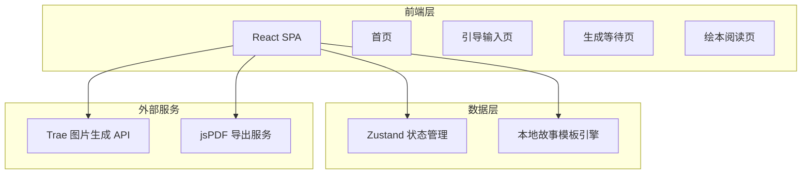

## 1. 架构设计



## 2. 技术说明

- **前端**：React@18 + TypeScript + Tailwind CSS@3 + Vite
- **初始化工具**：vite-init
- **后端**：无（纯前端项目，故事模板在前端本地生成）
- **状态管理**：Zustand
- **路由**：react-router-dom
- **PDF导出**：jsPDF + html2canvas
- **图片生成**：Trae text_to_image API
- **动画**：CSS animations + Framer Motion

## 3. 路由定义

| 路由 | 用途 |
|------|------|
| `/` | 首页 - 品牌展示与创作入口 |
| `/create` | 引导输入页 - 分步收集孩子信息 |
| `/generating` | 生成等待页 - 沉浸式等待动画 |
| `/book` | 绘本阅读页 - 翻页浏览与PDF导出 |

## 4. 核心数据模型

### 4.1 用户输入数据

```typescript
interface StoryInput {
  childName: string;
  favoriteAnimal: string;
  recentExperience: string;
  language: 'zh' | 'en';
}
```

### 4.2 绘本页数据

```typescript
interface BookPage {
  pageNumber: number;
  illustrationUrl: string;
  text: string;
}
```

### 4.3 绘本数据

```typescript
interface StoryBook {
  id: string;
  title: string;
  input: StoryInput;
  pages: BookPage[];
  createdAt: string;
  language: 'zh' | 'en';
}
```

## 5. 故事生成引擎

### 5.1 模板结构

故事基于预设模板生成，模板包含6页绘本结构：

1. **封面页**：书名 + 孩子名字 + 主角插画
2. **开场页**：介绍主角（孩子名 + 动物朋友）
3. **经历引入页**：将孩子的最近经历融入故事
4. **冒险页**：主角和动物朋友一起经历冒险
5. **结局页**：温馨收尾，回归日常生活
6. **封底页**：「属于XXX的故事」+ 星球装饰

### 5.2 模板变量替换

模板中使用 `{childName}`、`{animal}`、`{experience}` 等占位符，根据用户输入动态替换生成最终文本。

## 6. 图片生成策略

使用 Trae text_to_image API 为每一页生成插画：

- **封面页**：`"A cute {animal} and a happy child named {childName} on a colorful planet, warm children's book illustration style, soft pastel colors, rounded shapes"`
- **各页插画**：根据页面内容生成对应场景描述，统一使用温暖可爱风格 prompt
- **图片尺寸**：`landscape_4_3` 适合绘本横版展示
- **降级策略**：如果API调用失败，使用预设的渐变色占位插画
